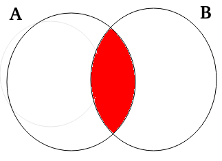
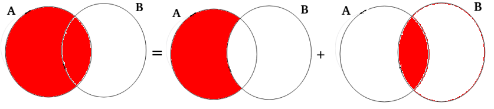
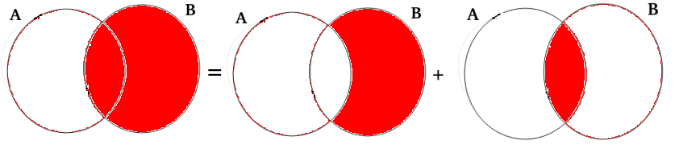
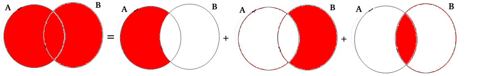

# Introdução ao Join com MySQL e com Laravel

União entre tabelas do MySQL

Para outros SGBD os comandos são semelhantes, com pequenas variações.

Para isto usa-se o conhecimento da teoria dos conjuntos, da matemática.

Existem basicamente 3 variações de join: inner join, left join e right join. Outras fromas apenas mostram uma melhor escrita do código.

Vamos trabalhar com duas tabelas: **a** e **b**, para ficar mais simples de aplicar/explicar os conceitos.
```sql
create database joins;

use joins;

create table a (name varchar(50) primary key);

create table b (name varchar(50) primary key);

insert into a (name) values ('Ribamar FS'), ('Fátima EF'), ('Tiago EF'), ('Elias EF');

insert into b (name) values ('Ribamar FS'), ('Fátima EF'), ('João Brito'), ('Pedro Brito');
```
## Inner Join

Retorna os registros comuns (intersecção) das duas tabelas.



### SQL
```sql
SELECT a.name, b.name
FROM a /* a é a tabela da esquerda/left */
INNER JOIN b /* b é a tabela da direita/right */
ON a.name = b.name
```
### Retorna:
```sql
name	name
Fátima EF	Fátima EF
Ribamar FS	Ribamar FS
```

## Left Join

Retorna todos os registros que estão somente em **a** mais os registros que estão na intersecção das duas tabelas/conjuntos.



### SQL
```sql
SELECT a.name, b.name
FROM a
LEFT JOIN b
ON a.name = b.name
```
### Retorno:
```sql
name	name
Elias EF	NULL
Fátima EF	Fátima EF
Ribamar FS	Ribamar FS
Tiago EF	NULL
```
Veja que de a retorna todos e de **b** somente aqueles que coincidem com os da **a**.

## Right Join

Retorna todos os registros que estão somente em **b**, mais os registros que estão ao mesmo tempo nas duas tabelas/intersecção.



### SQL 
```sql
SELECT a.name, b.name
FROM a
RIGHT JOIN b
ON a.name = b.name
```
### Retorno:
```sql
name	name
Fátima EF	Fátima EF
NULL	João Brito
NULL	Pedro Brito
Ribamar FS	Ribamar FS
```

## Outer Join ou Full Outer Join ou ainda Full Join

Retorna todos os registros que estão somente em **a**, mais todos os registros de **b** e também os registros que estão ao mesmo tempo nas duas tabelas/intersecção.



### SQL 

Não existe o comando OUTER JOIN no MySQL, então usamos um workaround/artifício/gambiarra:

```sql
SELECT a.name, b.name
FROM a
LEFT JOIN b
ON a.name = b.name
UNION
SELECT a.name, b.name
FROM a
RIGHT JOIN b
ON a.name = b.name
```

### Retorno:
```sql
name	name
Elias EF	NULL
Fátima EF	Fátima EF
Ribamar FS	Ribamar FS
Tiago EF	NULL
NULL	João Brito
NULL	Pedro Brito
```
Nas construções dos joins também podemos usar outros comandos: WHERE, ORDER BY, LIKE, etc.

## Joins usando QueryBuilder no Laravel

Inner Join

Inner Join entre as tabelas users, contacts e orders.

Para criar um inner join usamos o comando join. O primeiro argumento passado para o método join é o nome da tabela com a qual precisamos criar o join.
Podemos efetuar join com várias tabelas:
```sql
$users = DB::table('users')
            ->join('contacts', 'users.id', '=', 'contacts.user_id')
            ->join('orders', 'users.id', '=', 'orders.user_id')
            ->select('users.*', 'contacts.phone', 'orders.price')
            ->get();
```
Left/Right Join
```sql
$users = DB::table('users')
            ->leftJoin('posts', 'users.id', '=', 'posts.user_id')
            ->get();

$users = DB::table('users')
            ->rightJoin('posts', 'users.id', '=', 'posts.user_id')
            ->get();
```
Mais detalhes:

https://laravel.com/docs/8.x/queries#joins

## Avançando com Join

Criar as tabelas members e authors
```sql
CREATE TABLE members (
    id INT AUTO_INCREMENT,
    name VARCHAR(100),
    PRIMARY KEY (id)
);

CREATE TABLE authors (
    id INT AUTO_INCREMENT,
    name VARCHAR(100),
    PRIMARY KEY (id)
);

INSERT INTO members(name) VALUES('John'),('Jane'),('Mary'),('David'),('Amelia');

INSERT INTO authors(name) VALUES('John'),('Mary'),('Amelia'),('Joe');

SELECT * FROM members;

id	name
1	John
2	Jane
3	Mary
4	David
5	Amelia

SELECT * FROM authors;

id	name
1	John
2	Mary
3	Amelia
4	Joe
```
Alguns membros são autores e outros não.

## Inner Join
```sql
SELECT 
    m.id, 
    m.name as member, 
    a.id, 
    a.name as author
FROM
    members m
INNER JOIN authors a 
	ON m.name = a.name

id	member	id	author
1	John	1	John
3	Mary	2	Mary
5	Amelia	3	Amelia
```
Como o nome dos campos nas tabelas é o mesmo, name e name, podemos usar USING
```sql
SELECT 
    m.id, 
    m.name as member, 
    a.id, 
    a.name as author
FROM
    members m
INNER JOIN authors a USING (name); 
```
## Left Join
```sql
SELECT 
    m.id, 
    m.name as member, /* alias para name, apelido de member */
    a.id, 
    a.name as author /* alias para name, apelido de author */
FROM
    members m
LEFT JOIN authors a USING(name);

id	member	id	    author
1	John	1	    John
2	Jane	NULL	NULL
3	Mary	2	    Mary
4	David	NULL	NULL
5	Amelia	3	    Amelia
```
Retornando apenas os NULL na tabela de authors:
```sql
SELECT 
    m.id, 
    m.name as member, /* alias para name, apelido de member */
    a.id, 
    a.name as author /* alias para name, apelido de author */
FROM
    members m
LEFT JOIN authors a USING(name)
WHERE a.id IS NULL;

id	member	id	author
2	Jane	NULL	NULL
4	David	NULL	NULL
```
## Right Join
```sql
SELECT 
    m.id, 
    m.name as member, 
    a.id, 
    a.name as author
FROM
    members m
RIGHT JOIN authors a on m.name = a.name

id	    member	id	author
1	    John	1	John
3	    Mary	2	Mary
5	    Amelia	3	Amelia
NULL	NULL	4	Joe

Ou comm USING:
RIGHT JOIN authors a USING(name);
```
## Cross Join

Cross Join cria um produto cartesiano dos dois conjuntos/tabelas. Combina cada registro da tabela A com cada campo da tabela B. Veja que o exemplo abaixo tem 4 registros cujo id é 1, pois a tabela b tem 4 registros. Então fica assim: 1,4 1,3 1,2 e 1,1, depois com o 2 até o último.
```sql
SELECT 
    m.id, 
    m.name as member, 
    a.id, 
    a.name as author
FROM
    members m
CROSS JOIN authors a

id	member	id	author
1	John	4	Joe
1	John	3	Amelia
1	John	2	Mary
1	John	1	John
2	Jane	4	Joe
2	Jane	3	Amelia
2	Jane	2	Mary
2	Jane	1	John
3	Mary	4	Joe
3	Mary	3	Amelia
3	Mary	2	Mary
3	Mary	1	John
4	David	4	Joe
4	David	3	Amelia
4	David	2	Mary
4	David	1	John
5	Amelia	4	Joe
5	Amelia	3	Amelia
5	Amelia	2	Mary
5	Amelia	1	John
```
Referência:
https://www.mysqltutorial.org/mysql-join/

